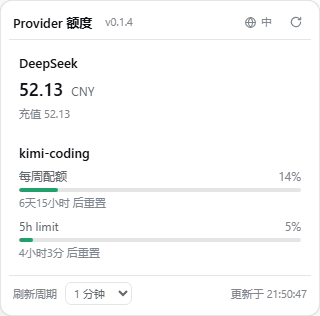
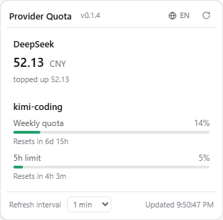

<p align="right">
  <a href="./README.md">English</a> · <strong>简体中文</strong>
</p>

<p align="center">
  <a href="https://www.npmjs.com/package/dsh-provider-quota"></a>
  <a href="./LICENSE"></a>
  
</p>

# dsh-provider-quota

[DeepSeek Harness](https://github.com/deepseek-ai/deepseek-harness) 插件：在 Web GUI 侧边栏底部实时显示所有已配置 LLM provider 的账户额度——不用再逐个登录 provider 控制台确认余额。

## 功能

- **自动探测** —— 自动枚举当前 profile 中已注册的 provider 路由（`ctx.llm`），常见路由零配置。
- **按 provider 类型查询额度**：
  - **DeepSeek**（`deepseek-official` 等）→ `GET {baseURL}/user/balance`（余额，含赠送/充值明细）
  - **Kimi Code 订阅**（`kimi-coding`）→ `GET {baseURL}/v1/usages`（每周配额及各限速窗口，含重置倒计时）
  - **Moonshot 开放平台**（`moonshotai-cn` / `moonshotai`）→ `GET {baseURL}/users/me/balance`
- **密钥安全** —— 通过 harness 凭据服务按次解析（环境变量 / `~/.dsh/.credentials.yaml`），不缓存、不落地。
- **侧边栏入口** —— 侧边栏底部按钮点击弹出额度面板；任一 provider 异常时按钮显示红点。
- **版本徽章** —— 面板标题旁显示当前运行的插件版本，一眼确认加载的是哪个发布版。
- **中英双语** —— 面板内置中英文界面，默认跟随 harness 系统语言，标题栏按钮一键切换（localStorage 持久化）。
- **刷新周期可调** —— 面板内调整（15s–30min，localStorage 持久化），默认值由插件配置提供。
- **手动 provider** —— 可通过配置添加任意网关（如自建 DeepSeek 兼容端点）。

## 截图

| 中文 | English |
| --- | --- |
|  |  |

## 安装

> [!NOTE]
> 需要先安装 [DeepSeek Harness](https://github.com/deepseek-ai/deepseek-harness)。

### npm

```sh
dsh plugin --profile web add dsh-provider-quota@latest
```

### 从源码构建

```sh
git clone https://github.com/lizhouai/dsh-provider-quota.git
cd dsh-provider-quota
pnpm install
pnpm build
pnpm pack   # 产出 dsh-provider-quota-<version>.tgz
dsh plugin --profile web add ./dsh-provider-quota-<version>.tgz
```

注意要安装 **tarball** 而不是仓库目录：`dsh plugin add .` 会链接整个仓库，仓库自带 `node_modules` 里的 `@deepseek-ai/cordis` 会遮蔽 harness 的共享实例，导致 host 半注册不上（RPC 404）。link 方式仍适合纯 UI 迭代（浏览器 bundle 自包含，重新 build + 刷新页面即生效），但需要 host 半时请切换到 tarball 或 npm 正式版。若替换 link 安装时 pnpm 报 `EPERM ... symlink`，手动删除 profile 目录下残留的 `node_modules/dsh-provider-quota` 联结后重试即可。

插件集合变化后需重启 `dsh web`；之后仅改动代码时重新 build + 重新 add + 刷新页面即可。

## 升级

```sh
dsh plugin --profile web add dsh-provider-quota@latest
```

然后重启 `dsh web` 并刷新页面。如果目标版本刚发布不久，profile 的供应链冷静期（`minimumReleaseAge`）可能会静默停留在旧版——这时指定精确版本号（如 `dsh plugin --profile web add dsh-provider-quota@0.1.5`），dsh 会自动豁免该版本。面板标题旁的版本徽章可以确认实际加载的版本。

## 配置说明

默认开箱即用：自动探测当前 profile 的所有 provider 路由。也可以在 `~/.dsh/profiles/web/cordis.patch.yml` 中调整：

```yaml
- insert:
    - id: provider-quota
      name: dsh-provider-quota
      config:
        refreshSeconds: 60   # 面板默认刷新周期（秒）
        autoDetect: true     # 自动枚举 llm 注册表中的 provider
        providers: []        # 手动补充/覆盖 provider（id 相同则覆盖自动探测结果）
```

| 字段 | 类型 | 默认 | 说明 |
| --- | --- | --- | --- |
| `refreshSeconds` | number | `60` | 面板建议刷新周期（秒），5–86400 |
| `autoDetect` | boolean | `true` | 从 llm 注册表自动枚举 provider |
| `providers` | array | `[]` | 手动 provider 规格：`{id, kind, baseURL, apiKeyEnv, displayName?, enabled?}`，`kind ∈ deepseek / kimi-coding / moonshot` |

也可以在 `~/.dsh/settings.yaml` 中通过 `provider-quota:` 命名空间热更新同样字段。

### 手动添加一个 provider 示例

```yaml
config:
  providers:
    - id: my-deepseek-gateway
      kind: deepseek
      baseURL: https://my-gateway.example.com
      apiKeyEnv: MY_GATEWAY_KEY
      displayName: 自建网关
```

## 架构

- **Host 半**（`src/index.ts`）：`QuotaService extends TypertRemoteService`，`@Remote('list')` 暴露 `quota/list`（SRC 模式，无需代码生成）；`Config` 用 schemastery 声明，`installSettingsSection` 支持 settings 热更新。
- **Client 半**（`src/client/`）：`window.__ModuleLoader__.load({id, factory})` 格式 bundle（tsdown 构建），注册到 `sidebar.footer.action` slot，通过 `ctx.connection.rpc.call('/api', 'quota/list', {args:{}})` 轮询。服务本身无状态——每次轮询都取实时值。

## 许可证

[MIT](./LICENSE)
